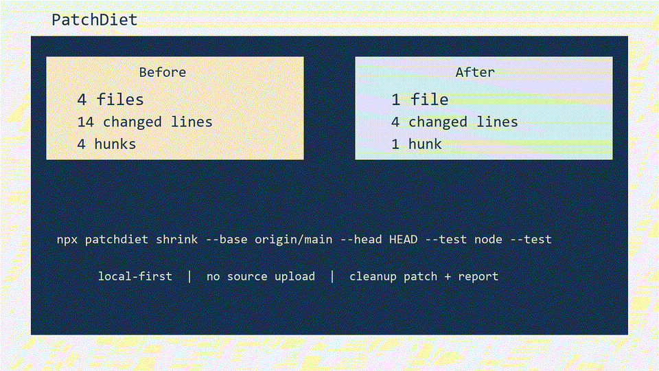

# PatchDiet

Your AI coding agent passed the tests. The PR was still bloated.

PatchDiet shrinks AI-generated pull requests into the smallest reviewable patch that still passes your checks.

```bash
npx patchdiet shrink --base origin/main --head HEAD --test "pnpm test"
```



## Example

Before PatchDiet:

- 4 files changed
- 14 changed lines
- 4 hunks
- tests passing, but review scope is inflated

After PatchDiet:

- 1 file changed
- 4 changed lines
- 1 hunk
- tests still passing
- cleanup patch generated
- line reduction: 71%

## What it removes

- unrelated refactors
- formatting-only hunks
- stale comments
- dependency bumps outside scope
- files that do not affect the requested behavior

## What it is not

PatchDiet is not an AI code reviewer.

It is not a coding agent.

It does not upload your code.

It is a patch minimizer for AI-generated diffs.

## Commands

- `patchdiet init`
- `patchdiet check --base origin/main --head HEAD`
- `patchdiet shrink --base origin/main --head HEAD --test "node --test"`
- `patchdiet shrink --base origin/main --head HEAD --test "node --test" --create-branch`
- `patchdiet report --format github`
- `patchdiet report --format json`

## Repo Layout

- `packages/core`: diff parsing, config, shrink engine
- `packages/report`: markdown/html/github renderers
- `packages/cli`: command line interface
- `packages/action`: GitHub Action wrapper
- `examples/*`: reproducible demo scenarios

## Safety

- local-first by default
- no source upload
- does not rewrite the current branch in place
- produces cleanup artifacts under `.patchdiet/`

## Status

`v0.1` currently ships conservative hunk-level reduction and reproducible TypeScript, Python, and monorepo demo flows. AST-level atoms, richer dependency reasoning, and benchmark datasets are planned but not included in this version.
